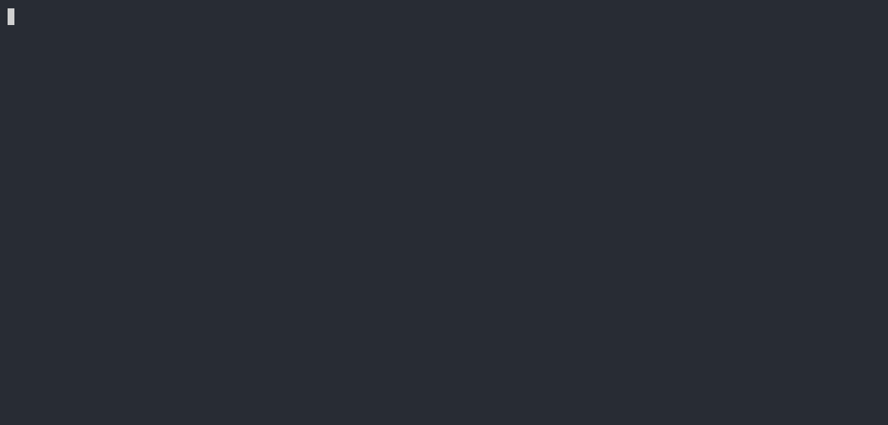
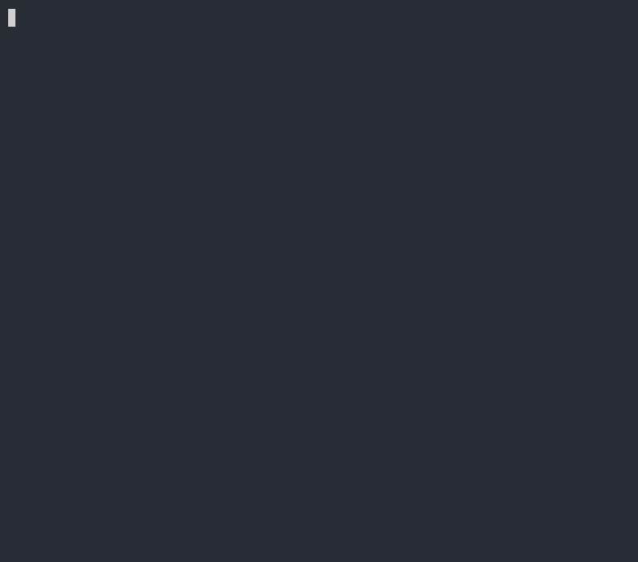
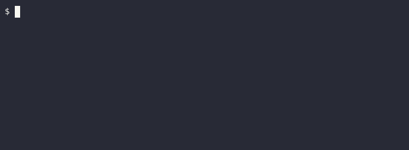
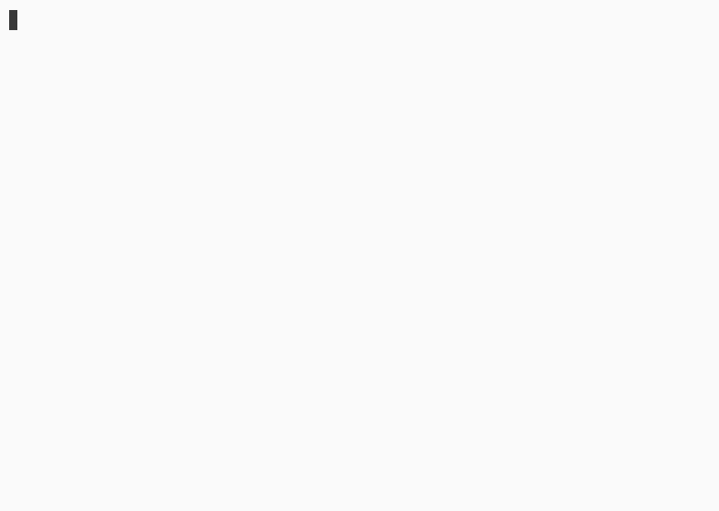
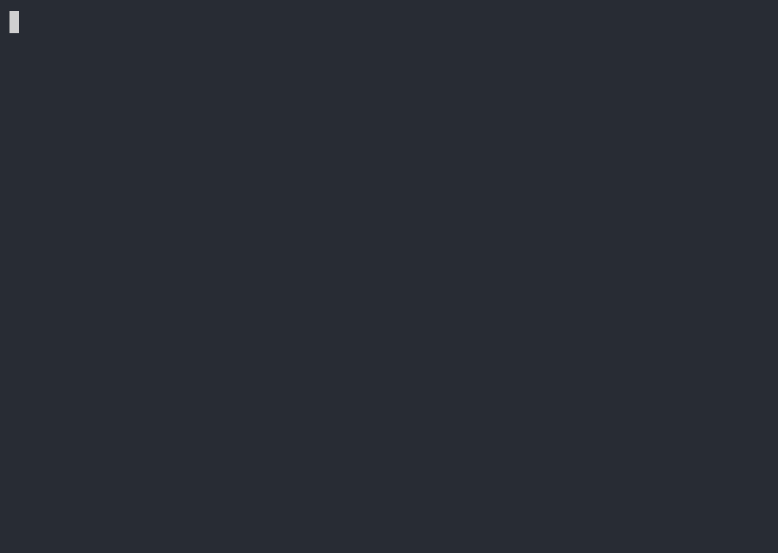
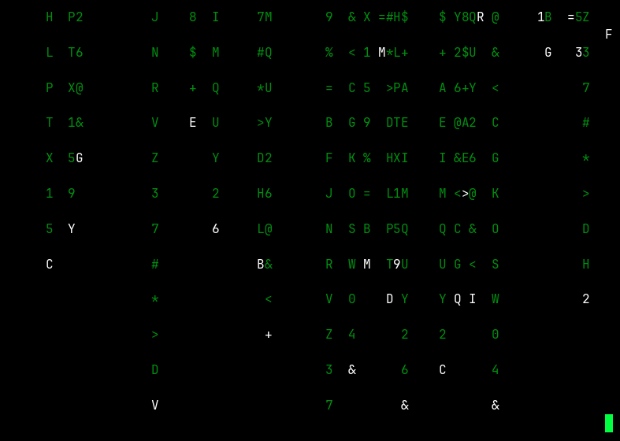
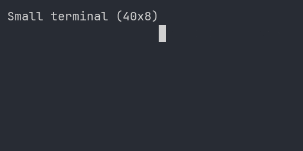

# Sample scenarios

[English](README.md) | 日本語

scenetake のサンプル集です。各シナリオの**目的**と**生成物**（GIF / SVG）を一覧で確認できます。

## 一覧

| シナリオ | 目的 | 入力 | 出力 |
|----------|------|------|------|
| [basic](#basic) | 入門・タイピング・ハイライト・sleep | [basic.yaml](basic.yaml) | [cast](basic.cast) · [gif](basic.gif) · [svg](basic.svg) |
| [demo](#demo) | README 用の一連のワークフロー | [demo.yaml](demo.yaml) | [cast](demo.cast) · [gif](demo.gif) · [svg](demo.svg) |
| [git](#git) | 実コマンドの git デモ | [git.yaml](git.yaml) | [cast](git.cast) · [gif](git.gif) · [svg](git.svg) |
| [highlight](#highlight) | コメント・stdout / stderr の色指定 | [highlight.yaml](highlight.yaml) | [cast](highlight.cast) · [gif](highlight.gif) · [svg](highlight.svg) |
| [theme](#theme) | light テーマ・16 / 256 色 | [theme.yaml](theme.yaml) | [cast](theme.cast) · [gif](theme.gif) · [svg](theme.svg) |
| [theme-macos](#theme-macos) | macOS ウィンドウ chrome | [theme-macos.yaml](theme-macos.yaml) | [cast](theme-macos.cast) · [gif](theme-macos.gif) · [svg](theme-macos.svg) |
| [theme-windows](#theme-windows) | Windows ウィンドウ chrome | [theme-windows.yaml](theme-windows.yaml) | [cast](theme-windows.cast) · [gif](theme-windows.gif) · [svg](theme-windows.svg) |
| [matrix](#matrix) | Matrix rain 向け contextual tint | [matrix-gen.cs](matrix-gen.cs) → [cast](matrix.cast) | [gif](matrix.gif) · [svg](matrix.svg) |
| [resize](#resize) | ターミナル resize イベント（cast のみ） | [resize.cast](resize.cast) | [gif](resize.gif) · [svg](resize.svg) |

## 再生成

リポジトリルートで実行します。

```bash
# すべての *.yaml から .cast と .svg を再生成
dotnet run samples/regenerate.cs

# matrix.cast は別途生成（regenerate.cs にも含まれる）
dotnet run samples/matrix-gen.cs

# GIF は agg が必要（Docker 例。v3 cast は ghcr.io/asciinema/agg を使用）
docker run --rm -v "$PWD:/data" ghcr.io/asciinema/agg \
  /data/samples/basic.cast /data/samples/basic.gif --last-frame-duration 0
```

---

## basic

**目的:** scenetake の基本機能を一通り見る入門サンプル。

- ステップ名コメント、タイピング演出、`curl` 出力の行ハイライト
- `sleep` による待ち、`stderr` のデフォルト色（赤）

| GIF | SVG |
|-----|-----|
|  |  |

```bash
scenetake --format svg samples/basic.yaml
```

---

## demo

**目的:** README に載せる「YAML → cast → GIF」までの流れを再現するデモ。

- `cat` でシナリオを表示 → `scenetake` で cast 生成 → `agg` で GIF 化（Docker）

| GIF | SVG |
|-----|-----|
|  |  |

```bash
scenetake --format svg samples/demo.yaml
```

---

## git

**目的:** 実際の `git` コマンド出力を記録した、リポジトリ向けデモ。

- `git status` / `log` / `branch` / `diff --stat`
- ステップごとの `post-delay`・`typing-speed` の調整例

| GIF | SVG |
|-----|-----|
|  |  |

```bash
scenetake --format svg samples/git.yaml
```

---

## highlight

**目的:** scenetake 固有の色付け（cast イベントへの SGR 注入）の総合サンプル。

- コメント行の色（`name` の `[style]`）
- `run-highlight`（入力コマンドの色）
- `highlight`（stdout の行・範囲指定）
- `stderr-color`（名前付き色・SGR リテラル）
- 256 色インデックス・true color

| GIF | SVG |
|-----|-----|
|  |  |

```bash
scenetake --format svg samples/highlight.yaml
```

---

## theme

**目的:** SVG / cast ヘッダーの **`render.theme`**（light プリセット）と ANSI 色の見え方。

- `render.font-size` / `theme.preset: light`
- 16 色・256 色の printf 出力

| GIF | SVG |
|-----|-----|
|  |  |

```bash
scenetake --format svg samples/theme.yaml
```

---

## theme-macos

**目的:** **`render.window: macos`** ウィンドウ chrome + dark テーマ。

| GIF | SVG |
|-----|-----|
|  |  |

```bash
scenetake --format svg samples/theme-macos.yaml
```

---

## theme-windows

**目的:** **`render.window: windows`** ウィンドウ chrome + dark テーマ。

| GIF | SVG |
|-----|-----|
|  |  |

```bash
scenetake --format svg samples/theme-windows.yaml
```

---

## matrix

**目的:** SVG の **Matrix rain contextual tint**（緑の隣の白ハイライトを明るい緑で描画）の確認。

- [matrix-gen.cs](matrix-gen.cs) が 12 fps・72 フレームの cast を生成（alternate screen、画面クリア、フレーム間にコマンド入力なし）
- ASCII 文字（英数字・記号）の落ちる列、白い先頭＋緑の尾（agg でも描画しやすい）
- 背景 `#000000`、尾 `#008f11`、先頭／tint `#00ff41` の Matrix 風パレット
- cast ヘッダーに macOS ウィンドウ chrome

| GIF | SVG |
|-----|-----|
|  |  |

```bash
dotnet run samples/matrix-gen.cs
scenetake svg samples/matrix.cast
docker run --rm -v "$PWD:/data" ghcr.io/asciinema/agg \
  /data/samples/matrix.cast /data/samples/matrix.gif --last-frame-duration 0
```

本物の `cmatrix` は PTY が必要です。外部録画する場合:

```bash
asciinema rec samples/matrix-live.cast -- cmatrix -ab
scenetake svg samples/matrix-live.cast --window macos
```

---

## resize

**目的:** cast の **`r`（resize）イベント** を SVG がどう扱うかの確認用。

- YAML はなく、手編集の [resize.cast](resize.cast) のみ（40×8 → 80×12 → 50×6）
- 縮小時の viewport クリップと chrome 連動の確認向け

| GIF | SVG |
|-----|-----|
|  |  |

```bash
scenetake svg samples/resize.cast
```
